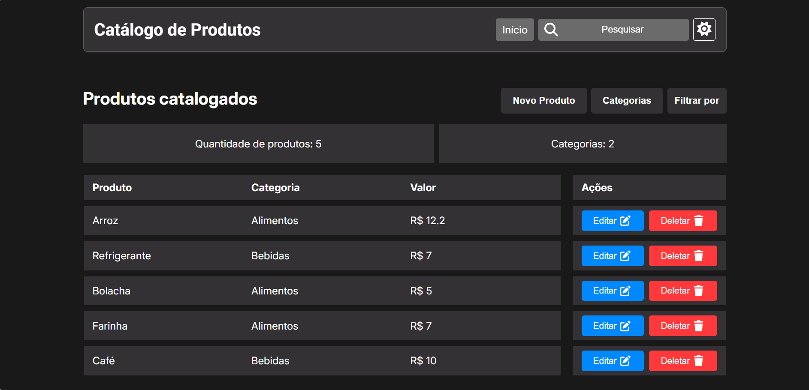

<h1 align="center">📦 Catálogo de Produtos 📦</h1>

## ℹ️ Sobre
Este projeto é uma **aplicação web desenvolvida em React** que representa um **Catálogo de Produtos**.
O objetivo principal do projeto foi criar uma **solução para uma necessidade real do cotidiano**, ao mesmo tempo em que possibilitou a aplicação prática de conceitos avançados do **ecossistema React**, desde arquitetura até gerenciamento de estado e performance.

#### 📍 Acesse o link: https://catalogo-produtos-react.vercel.app/
#### 🛡️ Segurança e controle de uso
Para evitar abuso em ambiente público, a API implementa:
- **Rate limit**: até 8 operações de escrita por minuto por IP (POST, PUT, PATCH e DELETE)
- **Regra de negócio**: limite máximo de 30 produtos cadastrados

Essas medidas garantem estabilidade e evitam spam automático.

---

## 📋 Funcionalidades
- **Criação de produtos:** o usuário pode adicionar novos produtos à lista de produtos, informando:
  - Nome
  - Valor
  - Categoria

- **Listagem de produtos:** o sistema permite a listagem de produtos em formato de tabela.

- **Edição de produtos:** produtos já cadastrados podem ser editados para correção ou atualização de informações.

- **Exclusão de produtos:** o sistema permite a exclusão de produtos.

- **Gerenciamento de categorias:**
  - Adição de novas categorias
  - Listagem de categorias
  - Edição de categorias
  - Exclusão de categorias
  - Filtragem de produtos por categoria

- **Mudança de tema:** alternância entre **tema claro e escuro** com pesistência no LocalStorage.

---

## ⚡ Gerenciamento de Estado Assíncrono com React Query

A aplicação utiliza **TanStack React Query** para controle avançado de estado assíncrono e cache de dados da API.

#### Principais recursos implementados:

- **Cache automático de requisições**
- **Sincronização inteligente entre múltiplos componentes**
- **Optimistic Update no delete**
- **Atualização manual de cache no create e update**
- **Rollback automático em caso de erro**
- **Tratamento de concorrência (404 tratado como sucesso lógico)**
- **Cancelamento de queries durante mutações**
- **Refetch automático ao focar na aba**
- **Separação clara entre loading inicial (`isLoading`) e refetch (`isFetching`)**

- **Benefícios obtidos:**
  - Melhor experiência de usuário (UI instantânea)
  - Redução de requisições desnecessárias
  - Maior controle sobre consistência de dados
  - Arquitetura preparada para ambiente multiusuário
  - Código mais declarativo e previsível

Os hooks personalizados useProduct e useCategory encapsulam toda a lógica de queries e mutations, mantendo os componentes limpos e focados apenas na renderização.

---

## 🛠️ Requisitos Técnicos
- **Validação robusta de formulários com schema**
- **Responsividade:** layout adaptado de maneira eficiente e eficaz para diferentes tamanhos de tela.
- **Persistência de dados:** Mock API REST com JSON Server, permitindo operações CRUD persistentes via HTTP.

---

## 🧠 Arquitetura e Padrões Utilizados
- **Arquitetura baseada em features:** organização do código por domínio de negócio (`products`, `categories`), facilitando manutenção e escalabilidade.
- **Componentização reutilizável:** componentes compartilhados centralizados em `shared/components`.
- **Separação de responsabilidades:**
  - Lógica de negócio isolada em **hooks personalizados**
  - Comunicação e regras encapsuladas em **services**
- **CSS Modules:** estilos escopados por componente, evitando conflitos globais.

---

## ⚛️ Hooks e Recursos do React

### Hooks nativos
- `useState` — gerenciamento de estado local
- `useEffect` — efeitos colaterais e sincronização de dados
- `useMemo` — otimização de valores computados
- `useCallback` — memoização de funções
- `useContext` — compartilhamento de estado global

### Hooks personalizados
- `useProduct` — gerenciamento completo de produtos (CRUD, regras de negócio)
- `useCategory` — controle e manipulação de categorias
- `useLoading` — controle reutilizável de estados de carregamento
- `useTheme` — controle de tema (claro/escuro) via Context API

---

### 🧾 Validação de Formulários
- **`React Hook Form`** para gerenciamento performático e otimizado de formulários
- **`Zod`** para validação declarativa e segura baseada em schema
- **Benefícios:**

  - Validação tipada e centralizada
  - Mensagens de erro controladas
  - Melhor performance (menos re-renderizações)
  - Código mais previsível e escalável

---

## 🌐 Gerenciamento de Estado Global

- **Context API** utilizada para:
  - Gerenciamento de tema
  - Compartilhamento de dados de categorias entre componentes
- Redução de **prop drilling** através do uso estratégico de providers
- Uso consciente de **prop drilling** apenas quando o escopo é local e controlado

---

## 🧭 Roteamento e Navegação

- **React Router DOM** para controle de rotas da aplicação
- Uso de:
  - `useNavigate` para navegação programática
  - `useSearchParams` para filtros e estados persistidos na URL
- Separação clara entre **páginas** e **componentes**

---

## 📁 Estrutura de Pastas
A aplicação segue uma organização pensada para projetos escaláveis:
- `features/` — domínios principais da aplicação (produtos e categorias)
- `hooks/` — hooks globais reutilizáveis
- `providers/` — Context Providers
- `shared/` — componentes e layouts compartilhados
- `pages/` — páginas associadas às rotas

---

## 🚀 Tecnologias Utilizadas
- **React** (Hooks, Context API)
- **TanStack React Query**
- **React Hook Form**
- **Zod**
- **React Router DOM**
- **JavaScript (ES6+)**
- **CSS Modules**
- **date-fns**
- **Vite**
- **JSON Server** (persistência de dados)
- **LocalStorage (tema)**

---

## 📄 Licença
Este projeto está sob a licença **MIT**.
Consulte o arquivo `LICENSE` para mais informações.
